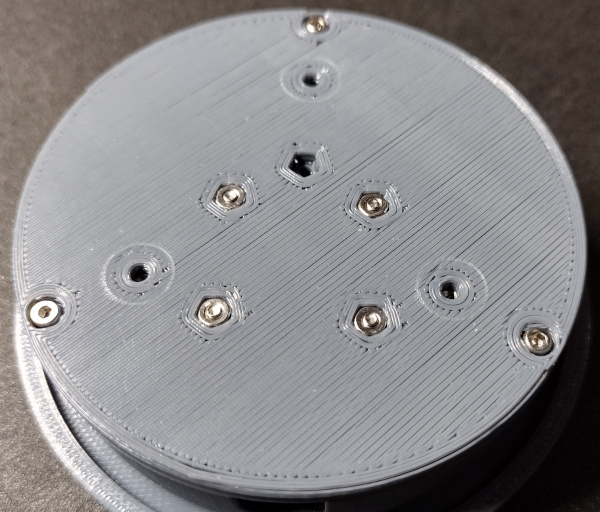
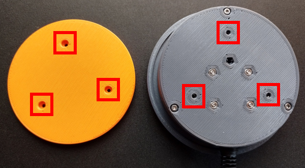
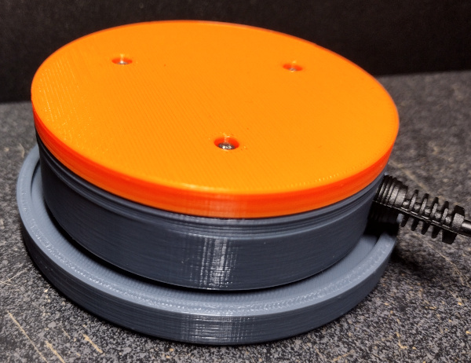
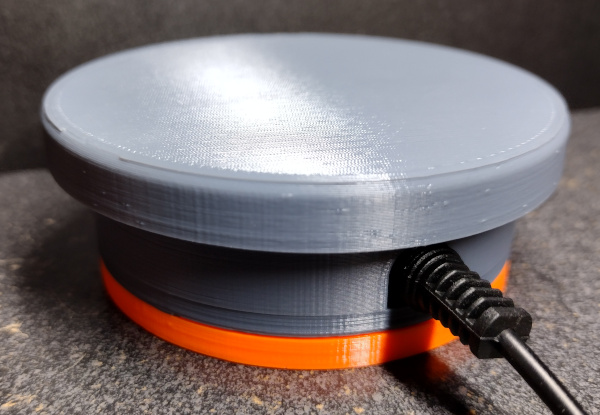

[M2x6mm Socket Head Screw]:Parts.yaml#M2x6SocketHeadScrew
[M2x8mm Socket Head Screw]:Parts.yaml#M2x8SocketHeadScrew
[M2x12mm Socket Head Screw]:Parts.yaml#M2x12SocketHeadScrew
[M3x6mm Socket Head Screw]:Parts.yaml#M3x6SocketHeadScrew
[1/4 Inch Heavy Rubber Band]:Parts.yaml#HeavyQuarterInchRubberBand
[1.5mm Hex Wrench]:../mechanical/Tools.yaml#HexWrench_1.5mm
[2.5mm Hex Wrench]:Tools.yaml#HexWrench_2.5mm
# Final Assembly

## Bill of Materials

{{BOM}}

## Introduction

Assuming that all of the previous mechanical and electrical sections have been completed, it is now possible to assemble the switch for use. Please be aware that some of the parts interlock in a specific way, and so the order of the assembly steps matters.

## Step 1: Attach the PCB Assembly to the Bottom

The finished circuit board is installed into the area of the switch bottom that has the relief pocket for the soldered pins. The relief pocket is highlighted in the following image.

The assembled PCB (circuit board) should be placed so that the 4 mounting holes line up with the 4 holes near the corners of the relief pocket. The PCB should be oriented so that the plunger on the microswitch is near the center of the switch bottom, and the open part of the audio connector faces the outer edge. Then an [M2x6mm Socket Head Screw]{Qty:4} can be placed in each of the 4 holes and tightened with a [1.5mm Hex Wrench]{Qty:1, Cat:Tool}. The result should look like the following image.

## Step 2: Attach the Stem to the Cap

Turn the switch cap over on the table so that the hole with the M3 captive nut is facing up. Place the stem on top of the cap so that the holes align and the counter-bore of the hole in the stem is facing up. An [M3x6mm Socket Head Screw]{Qty:1} can be inserted and tightened with a [2.5mm Hex Wrench]{Qty:1, Cat:Tool} to secure the stem to the cap. When finished, the two parts should look like the following.

## Step 3: Place the Body on the Cap

Lay the switch body upside down on top of the cap, centering the hole in the body with the stem on the cap. It does not have to be perfectly centered. That will be addressed in a future step. The stack should now look like the following.

## Step 4: Attach the Rubber Band Mounts

The rubber band mounts can now be attached to the stem. This part provides the attachment points for the rubber bands that will be used to suspend the cap for the user to press.

Lay the rubber band mounts on top of the stem, aligning the two holes with the holes in the stem. Place an [M2x6mm Socket Head Screw]{Qty:2} in each of the two holes and tighten with the [1.5mm Hex Wrench]{Qty:1}. The partial assembly should now look like the following.

Notice how the screw heads are aligned with the cutout in the body of the switch. This orientation will be important when the bottom is attached. The following image illustrates the proper alignment.

## Step 5: Install the Rubber Bands

The rubber bands suspend the cap within the body of the switch, and stand in for something like a metal coil spring. A small size of rubber bands are used here, but there are other sizes of rubber bands or windings that may also work. This is just the configuration that has been found to work the best in testing.

**WARNING:** The rubber bands are typically used in dental applications and may contain latex. If you have a latex allergy, take the proper precautions such as wearing gloves. The rubber bands will be enclosed within the switch after it is fully assembled and should not come in contact with the user during normal operation.

Using a pair of tweezers, loop a [1/4 Inch Heavy Rubber Band]{Qty:4} between one of the pegs on the rubber band mounts and the peg on the switch body. This can take some patience, but the pegs are tapered so that the rubber bands will not slip off during use. The first set of pegs with the (orange) rubber band on it should look like the following.

Install the rest of the rubber bands in a similar manner, and the end result should look like this.

Make sure that the screw heads on the rubber band mounts are still oriented as in the image above with the red T. Sometimes that screw orientation can become rotated while working to slip the rubber bands over the pegs.

## Step 6: Install the Bottom

The final assembly step before plugging in and testing the switch is to attach the switch bottom to the rest of the assembly. 

Lay the switch bottom on the rest of the assembly so that the audio connector lines up with the cutout in the body. If these are not aligned properly it will not be possible to plug the mono audio cable into the audio connector. The screw holes that are used to attach the bottom to the body are highlighted in the following image, which also shows the orientation of the captive nuts on the bottom in relation to the cutout in the body. Attaching the bottom this way will ensure the proper orientation as long as all other assembly steps have been done correctly.

Place an [M2x12mm Socket Head Screw]{Qty:3} in each of the 3 holes highlighted above and tighten them with a [1.5mm Hex Wrench]{Qty:1, Cat:Tool}.

**Note:** If the head of the screw will not draw down into the counter-bore pocket, either the captive nuts have not been installed in the switch body, or they have not been drawn down far enough into their pockets. Please check the [Captive Nut Installation](../mechanical/captive_nuts.md) section to make sure they were installed properly.

The bottom of the assembly should now look like the following.

The assembly is now complete. A mono audio cable can be plugged into the audio connector on the PCB through the cutout in the cutout in the body. The other end of the audio cable can then be plugged into a switch adapter for testing.

Once tested, the switch should be ready to use.

## Step 7: Attaching a Base

The switch will work fine as it is without a base, but there is no mechanism for mounting the switch. Also, the screws that secure the PCB to the switch bottom can sometimes stick out just enough to scratch the surface of a desk. Rubber feed can be used on the bottom of the switch in place of a base, but in most cases some sort of base 

There are two sample bases included with this design, and it is hoped that the community will develop more over time. The switch is designed so that bases can be interchangeable and easy to swap. The two sample bases for this design are in the [STL zip file](http://7bindustries.com/static/downloads/push_button_switch/v1/push_button_switch_stl_files.zip). The file names are below.

* sample_base_straight.stl
* sample_base_flange.stl

The "straight" base is meant for use on a desktop. It has a smooth bottom and no mounting holes other than the 3 used to attach it to the switch bottom. An [M2x8mm Socket Head Screw]{Qty:3} screw is used in each of the 3 holes, and tightened with the [1.5mm Hex Wrench]{Qty:1}. The following image highlights the mounting holes in the switch bottom and the matching holes in the base.

The following image shows the straight base (orange) attached to a switch. 

If the screws to not tighten and pull the base up to the switch bottom, make sure that you installed the captive nuts properly per the instructions on the [Captive Nut Instructions](../mechanical/captive_nuts.md).

The "flange" base has a lip that runs around the outside of the switch with holes all around it. The intention is for the flange to make it easier to mount the switch to a wheelchair or a bed.

It is easy to envision other designs as well, including a tube mount base. To aid in the creation of custom switch bases, a [Custom Bases](../designing_custom_bases.md) section has been created in this documentation that provides some instruction.