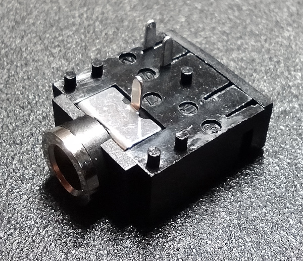
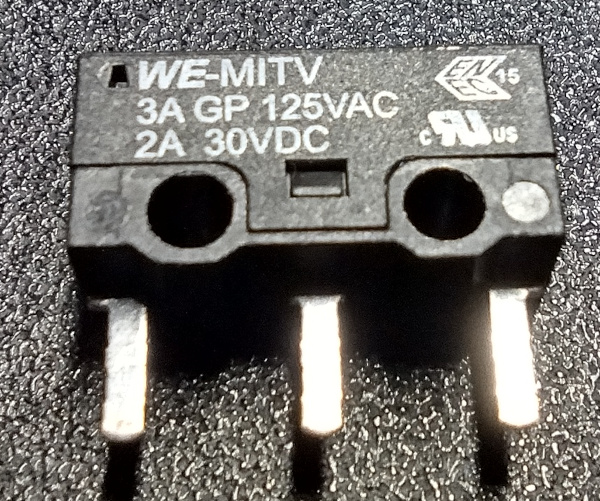
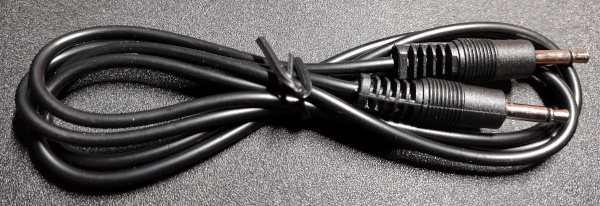

[Audio Jack]:Parts.yaml#MonoJackHDR_3.5mm
[Microswitch]:Parts.yaml#Microswitch
[Mono Audio Cable]:Parts.yaml#MonoAudioCable
# Order Components

There are two off-the-shelf components that must be ordered in order to assemble the circuit board. The first is an [Audio Jack]{Qty:1}, and the second is a [Microswitch]{Qty:1}. There is also a [Mono Audio Cable]{Qty:1} that is not needed to assemble the circuit board, but will be needed later to connect the switch to a switch adapter. That is shown in the bill of materials at the bottom of this page so that it can be ordered along with the other components.

Clicking on each of the components in the bill of materials (BOM) below will show suppliers they can be purchased from. If only a single board is being assembled, one of each part is all that is needed. The audio cable can be purchased in any length that is needed for the application. Cables of 0.9m to 1.2m are shown in the BOM as examples only.

{{BOM}}
