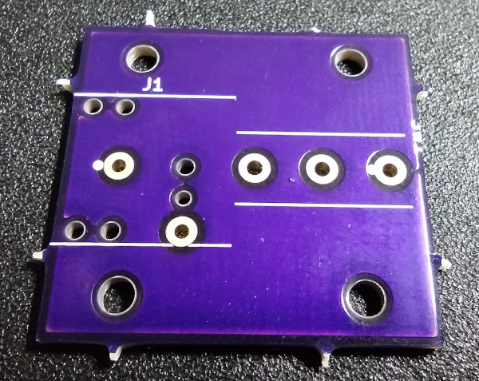
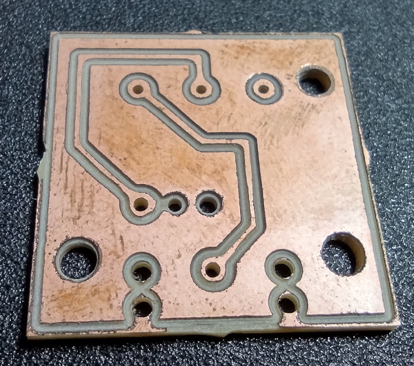

# PCB Manufacture

## Sending Files to a Manufacturer

All of the files necessary to have the printed circuit board (PCB) manufactured for you are available as a zip file for download [here](https://7bindustries.com/static/downloads/push_button_switch/v1/push_button_switch_grb.zip). If a manufacturer such as OSHPark is being used, the KiCAD project file can be uploaded directly. That file can be downloaded [here](https://raw.githubusercontent.com/7B-Things/push-button-switch/main/pcb/push-button-switch/push-button-switch.kicad_pcb) (right click and select `Save Link As`). Instructions on uploading files for every manufacturer is beyond the scope of this documentation, but OSHPark will be offered as an example. This is not a direct endorsement of OSHPark, although 7B Industries does use OSHPark to produce finished PCBs.

### Step 1 - Account Login

Navigate to [oshpark.com](https://oshpark.com/) and [create an account](https://oshpark.com/users/sign_in) or log in.

### Step 2 - Upload Files

The OSHPark website has an area where the KiCAD project file can be dragged and dropped. Alternatively, users can click the `BROWSE FOR FILES` button and upload the file through their operating system's file manager.

The file should upload, be processed, and then an `About your board` page will load. Initial information such as the cost of manufacturing should be displayed.

### Step 3 - Click Through the Board Confirmation Screens

The default settings should be fine for this design. Click the `Continue` button to advance past the `About your board` page.

The next page that will be loaded is called `Verify your design`. Scroll down through the images shown of the board just to make sure that nothing obvious is wrong. Once at the bottom of the page, click the `Order` button.

### Step 4 - Ordering

The rest of the process is typical of most online shopping carts. There is no need to add any of the optional services such as "2 oz copper" unless you want to. Check out, enter the shipping information, and pay. 

### Step 5 - Wait

When ordering PCBs from online manufacturers, it often takes weeks to receive the finished boards. It is also a good idea to check to see if there will be any import fees that are due. Selecting a manufacturer that is closer to your location may help avoid unnecessary import duties. 

## Isolation Routing (Optional Advanced DIY Manufacturing)

The PCB has been laid out in such a way that it is possible to use isolation routing on a CNC machine to manufacture it. That is how the initial prototypes are made by 7B Industries. This method should not be attempted unless the user is familiar with CNC machines. This method only provides a board with the proper traces, but does not include solder mask and silkscreen.

When isolation routing is attempted, use a v-shaped engraving bit set to the appropriate depth. The traces have 0.508 mm of clearance around them, so by setting the proper depth of the bit and the width of the tool to 0.508 mm, it should be possible to route the board in a single pass. Experimentation is often needed to complete this process effectively though.

