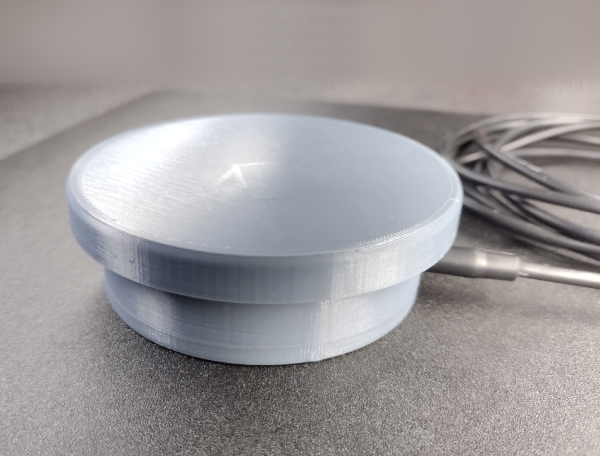

# Push Button Switch

## Introduction

This is a 3D printed switch for many uses, including controlling a computer when used with screen scanning software.

There are multiple modes for screen scanning software. In one mode, the screen scanner will move between user interface elements and allow the user to press the button to activate or select one. Onscreen keyboards can oftentimes be used in this way. In another mode, quadrants of the screen are scanned. A user waits until the scanner box reaches the desired part of the screen and then presses the button. The screen scanning software then narrows down its search that that part of the screen and the process begins again until the desired user interface element can be selected.

There are two main sections of this documentation: electrical and mechanical. The mechanical documentation covers printing all the parts, as well as sourcing and installing fasteners. The electrical section covers the custom circuit board and the components that go on it, as well as two alternative assembly methods. The electrical assembly must be available before the mechanical assembly can be completed.

## Construction Steps

The two sections below provide instructions for constructing the push button switch.

* [.](./electrical/electrical.md){step}
* [.](./mechanical/mechanical.md){step}

## Licenses

* Documentation: [Attribution-ShareAlike 4.0 International](https://creativecommons.org/licenses/by-sa/4.0/)
* Software: [Apache License, Version 2.0](https://www.apache.org/licenses/LICENSE-2.0.html)
* Hardware: [CERN Open Hardware Licence Version 2 - Permissive](https://ohwr.org/cern_ohl_p_v2.txt)