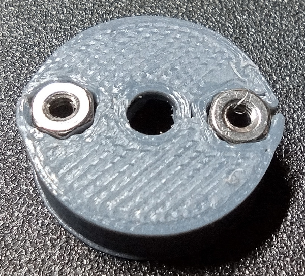

[M2x16 Socket Head Screw]:Parts.yaml#M2x16SocketHeadScrew
[M2 Washer]:Parts.yaml#M2FlatWasher
[M2 Captive Nut]:Parts.yaml#M2HexNut
[M3 Square Nut]:Parts.yaml#M3SquareNut
[1.5mm Hex Wrench]:Tools.yaml#HexWrench_1.5mm
# Add Captive Nuts

This switch design uses captive nuts instead of threading screws directly into the plastic, or using heatset inserts. Threading screws directly into plastic, even if the plastic is tapped, makes for a weak connection because the plastic threads strip out easily. Heatset inserts create a very strong connection, but are hard to install squarely into a hole, and tend to cause distortion of the plastic around the insertion site, such as mounding.

The M2 nuts will be pulled down into their pockets in this step so that the assembly step can happen more smoothly later.

## Bill of Materials

{{BOM}}

## Step 1: Prepare the Puller Bolt

A longer M2 screw is used to pull the M2 nuts squarely into their pockets. An [M2x16 Socket Head Screw]{Qty:1} can be used as the puller, and should have an [M2 Washer]{Qty:1} placed on it so that the head does not indent the plastic under it while the nut is being pulled into position.

## Step 2: Install the PCB Captive Nuts

There are 4 nuts that will be used to hold the PCB (printed circuit board) in place. The locations of these nut pockets are in the bottom side of the bottom part of the switch, and are shown in the following image.

These are the same holes viewed from the top side.

Insert the nut puller screw through the top side of the bottom part, and thread an [M2 Captive Nut]{Qty: 4} onto the end. Thread the nut on until it comes in contact with the pocket.

**WARNING:** Do not over-tighten the nuts in this step. Too much torque can cause the nuts to spin in their pockets, which will strip the plastic out so that the pocket will no longer hold the nut captive. Just make sure the top face of the nut is at, or a little below, the surface of the plastic.

Now take the [1.5mm Hex Wrench]{Qty:1, Cat:Tool} and tighten the puller screw until the captive nut is seated in the pocket. Make an effort to keep the points of the nut aligned with the points of the pocket. This often happens naturally as the screw is tightened. Continue tightening the screw until the nut has obviously bottomed-out in the pocket, or the nut is at or below the surface.

Once this first nut has been installed, remove the puller screw and seat the remaining three nuts in their respective pockets.

**NOTE:** If the M2 nut is too large for the pocket, there is not a good work around. The best options are to buy M2 nuts that are the proper size, or download the CAD model for the switch bottom and modify the captive nut pocket size.

When all captive nuts are installed, the bottom should look something like this.

## Step 3: Install the Mounting Base Captive Nuts

There are three holes in the switch bottom which will be used later to attach a mounting base. The intention is for these bases to be designed and printed for each use case. Examples might be a v-block base for mounting the switch to a metal tube, or a flat base with pockets where double stick tape can be applied.

The three mounting base captive nut pockets are highlighted below.

And here are the same hole locations when viewed from the bottom side.

**WARNING (Again):** Do not over-tighten the nuts in this step. Too much torque can cause the nuts to spin in their pockets, which will strip the plastic out so that the pocket will no longer hold the nut captive. Just make sure the top face of the nut is at, or a little below, the surface of the plastic.

Repeat the same process with the puller screw that was used in *Step 2*, and pull each [M2 Captive Nut]{Qty: 3} down into their pockets. When finished, the switch bottom should look like the following when viewed from the top side.

Installation of the captive nuts in the switch bottom is now complete.

## Step 4: Install the Stem Mounting Nuts

There are two holes in the switch stem that hold the rubber band mounts in place. The locations of the nut traps for these holes is shown in the following picture.

Install each [M2 Captive Nut]{Qty: 2} as in steps 3 and 4, as always, being sure not to over-torque the nuts. When finished, the stem should look like the following.

Notice that there can be a little deformation at the edges of the stem from where the nuts are pressed in. This is acceptable as long as the deformation is around the outside edge, and not on the top or bottom surface of the stem. In the future the diameter of the switch stem may be increased to prevent this issue.

## Step 5: Install Body Captive Nuts

There are three captive nuts that need to be installed in the switch body, and those will be used to attach the bottom during the final assembly process. The locations of each of the holes are highlighted in the following image.

Pull an [M2 Captive Nut]{Qty:3} down into each of these pockets using the puller screw technique and the [1.5mm Hex Wrench]{Qty:1} that has been used in other steps. These pockets are deeper than any of the others, and the nuts need to be pulled down to the bottom of each pocket to work correctly during final assembly.

The nut should measure about 4mm from its top to the top of the switch body. The following image shows how deep one of the nuts looks in the pocket.

## Step 6: Install Square Captive Nut

There is one last captive nut to install, and that is in the switch cap. The location is shown in the following image.

The [M3 Square Nut]{Qty:1} can be inserted into the pocket with fingers or tweezers. A set of curved tip tweezers makes insertion easier. Be sure to push the nut all the way down into the pocket so that the threaded hole in the center of the nut lines up with the hole in the switch cap. Pushing with a pair of tweezers or a small L-shaped hex wrench can help.

If the nut will not not seat all the way down into the pocket, there may be a bit of plastic in the pocket. The square nut can be removed with tweezers by placing the tips down in the center hole and pushing the nut towards the pocket opening. Then any extra plastic should be cleared from the pocket with tweezers.

The next images show the square nut properly installed in the switch cap.

After that square nut is installed, it is now possible to move on to the [assembly step](../assembly/assemble.md).
