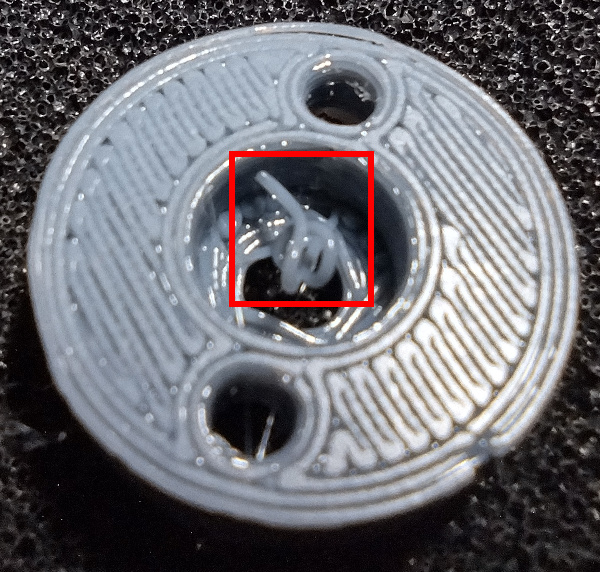
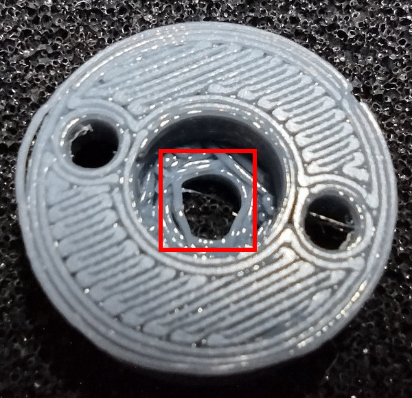
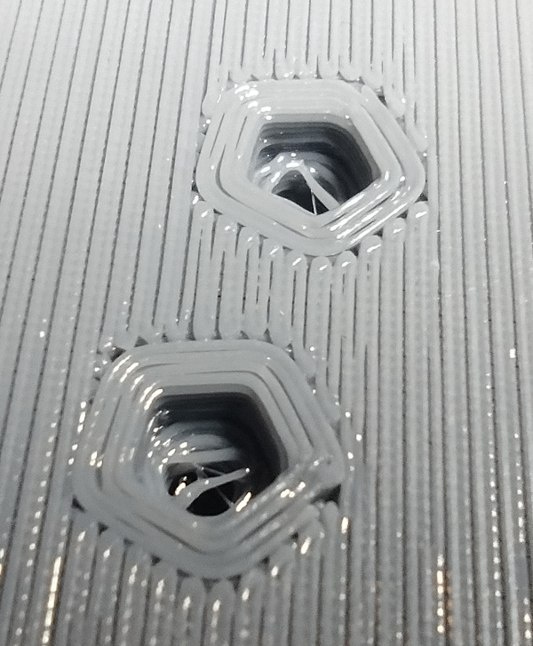

[Tweezers]:Tools.yaml#Tweezers
# Clean Up Parts

## Bill of Materials

{{BOM}}

The parts should almost be ready to assemble. However, there is often some extra plastic in the holes, nut traps, or counter-bore holes. These areas should be cleaned up before doing the assembly step.

## Extra Plastic in Counter-Bore

Below is an example of a counter bore hole with an extra plastic string in it. This extra plastic will keep the bolt from seating properly in the bottom of the hole and must be removed.

Most plastic strings are easy to remove with [Tweezers]{Qty:1, Cat:Tool}. The string in the picture above can be removed by grabbing it with the tweezers and twisting.

## Non-Round Hole

Sometimes plastic will ooze during a move of the print head when it should not, and can string across open areas. Most of the time there is no issue with the roundness of a hole, but sometimes the hole is bad enough that it will not let a bolt pass through.

In this case, a drill bit can be used to clean up the hole. Be careful not to force a drill bit through the hole that is too large, or the size tolerance of the hole may be altered too much. If using a power drill with the drill bit, be careful not to damage the hole by enlarging it or making it an oval shape.

## Extra Plastic in Nut Trap

Captive nuts are used throughout this design instead of heatset inserts or simply threading into the plastic. This ensures a durable design without the complications that using heatset inserts can cause. Sometimes there is excess plastic inside the nut pockets which can prevent the nuts from pulling all the way down into the pocket. This should be cleaned out with tweezers.

## Light Plastic Strings in Hole

There can sometimes be plastic strings in bolt holes. If the strings are small and light, there is a good chance that they will not cause problems. As long as you are able to insert the bolt into the hole, these can usually be left alone.
