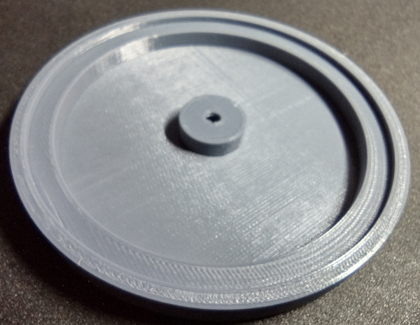

[3D Printer]:Tools.yaml#3DPrinter
[Filament]:Parts.yaml#Filament
# Print Parts

## Bill of Materials

{{BOM}}

## Step 1: Download STL Files

A zip file of all STL files needed to print the switch are available [here](https://7bindustries.com/static/downloads/push_button_switch/v1/push-button-switch-stl-files.zip).

Once that file has been download and the STLs have been extracted, the parts can be printed. Depending on what type of printer you have, it may be possible to upload the STL files directly to the printer. On other printers it will be necessary to use slicing software such as [Cura](https://ultimaker.com/software/ultimaker-cura) or [PrusaSlicer](https://www.prusa3d.com/page/prusaslicer_424/) to convert the STL files into GCode for the printer.

## Step 2: Determine Print Settings

Almost any [3D Printer]{Qty:1, Cat: Tool} can be used for printing these parts as long as the printer has a large enough print volume and can achieve the proper amount of detail. For reference, the prototypes were printed on a Prusa i3 Mk2 with a 0.4mm nozzle. Both PLA or PETG types of [Filament]{Qty:20m} have been used to print these parts. PETG will produce more durable parts but is not required.

None of these parts should need supports, but it is usually a good idea to print them with a brim. Using a brim will help maintain flatness on the 3D printer bed during the print. The print settings that were used on the prototypes was a 0.2mm layer height, no support, 20% infill, and the brim was enabled. Some of the parts in the STL are not oriented for printing by default. All parts are designed so that the larger flat surface should be placed on the print bed, with no supports needed.

One other setting that is not required but that can help with durability is to increase the number of perimeters, if your software supports it. On the prototypes, the number of perimeters was increased from 2 to 4.

## Step 3: Print Parts

The following is the list of parts that should be in the zip file.

* band_mounts.stl
* switch_stem.stl
* switch_cap.stl
* switch_body.stl
* switch_bottom.stl

These are standard STL files that should work with any 3D printer and/or slicing software. Follow the instructions for your 3D printer to print each of the parts. Here is a gallery of what each the files above should look like when printed.

Once all the parts have been printed, the next step is to [clean up the parts](clean_up_prints.md).